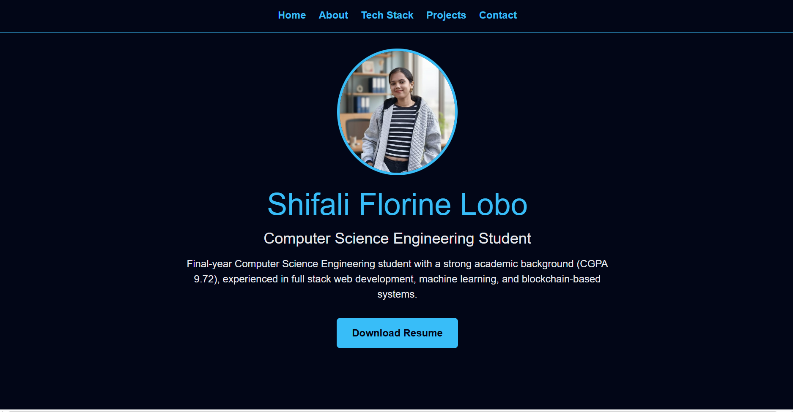
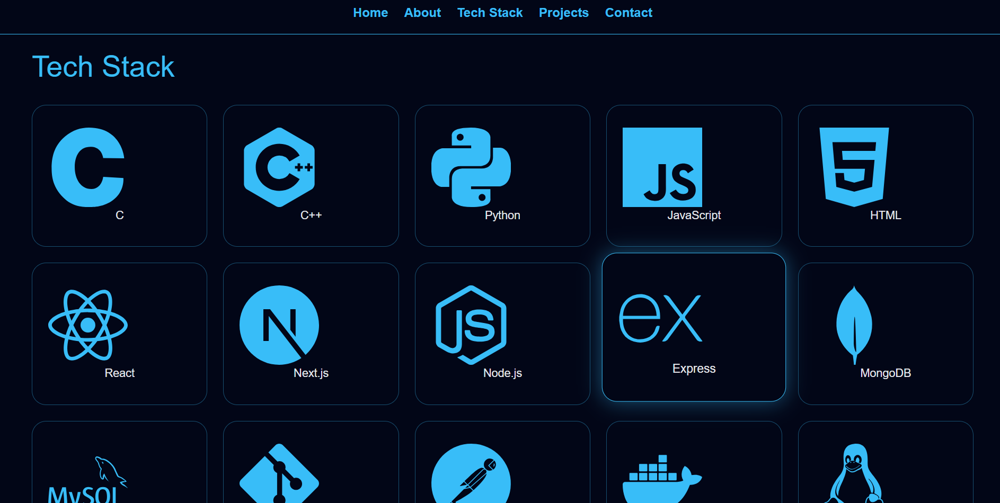
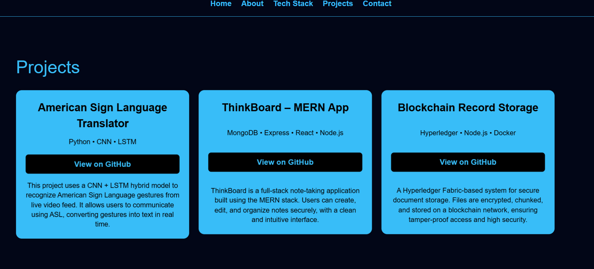
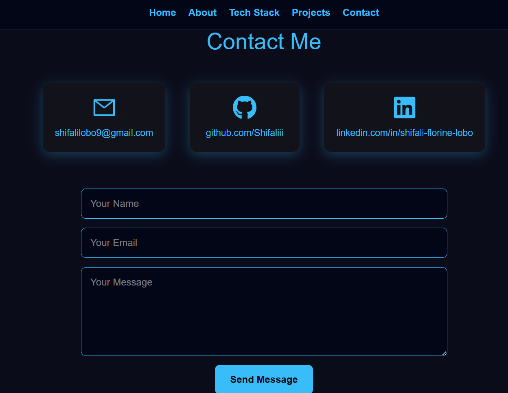

# 🌐 Personal Portfolio – Shifali Florine Lobo

This is my personal **portfolio website** built using **Next.js**, showcasing my skills, projects, and contact information. The website is fully responsive, modern, and designed with a clean black–blue developer theme.

🔗 **Live Website:** https://next-js-nine-lake-81.vercel.app
  
📦 **GitHub Repository:** https://github.com/Shifaliii/nextJS

---

## ✨ Features

- ⚡ Built with **Next.js (App Router)**
- 🎨 Modern black–blue UI theme
- 📱 Fully responsive (mobile, tablet & desktop)
- 🧠 Tech Stack section with interactive cards
- 💼 Projects section with GitHub links
- 📬 Contact section with social links & form
- 🚀 Deployed on **Vercel**

---
## 📸 Screenshots

### 🏠 Home Page


### 🧑‍💻 Tech Stack Section


### 📂 Projects Section


### 📬 Contact Section



## 🛠️ Tech Stack

- **Frontend:** Next.js, React, TypeScript  
- **Styling:** Inline CSS (custom responsive logic)  
- **Icons:** React Icons  
- **Deployment:** Vercel  
- **Version Control:** Git & GitHub  

```

## 📂 Project Structure

├── app/
│ └── page.tsx
├── public/
│ ├── profile.jpg
│ └── resume.pdf
├── package.json
├── tsconfig.json
└── README.md

```

## 🚀 Getting Started (Run Locally)

1. Clone the repository:
'''git clone https://github.com/Shifaliii/nextJS.git```

2.Navigate into the project directory:

```cd nextJS```


3.Install dependencies:

```npm install```


4.Start the development server:

```npm run dev```


5.Open in your browser:

```http://localhost:3000```

👩‍💻 About Me

I am a final-year Computer Science Engineering student with a strong academic background (CGPA 9.72).
My interests include full stack web development, machine learning, and blockchain-based systems.
I enjoy building scalable, secure, and user-focused applications.

📬 Contact

Email: shifalilobo9@gmail.com

GitHub: https://github.com/Shifaliii

LinkedIn: https://www.linkedin.com/in/shifali-florine-lobo-1b2923243/

📄 License

This project is open-source and available for learning and personal use.

⭐ If you like this project

Give it a star ⭐ on GitHub — it really helps!
